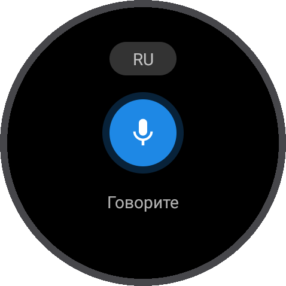
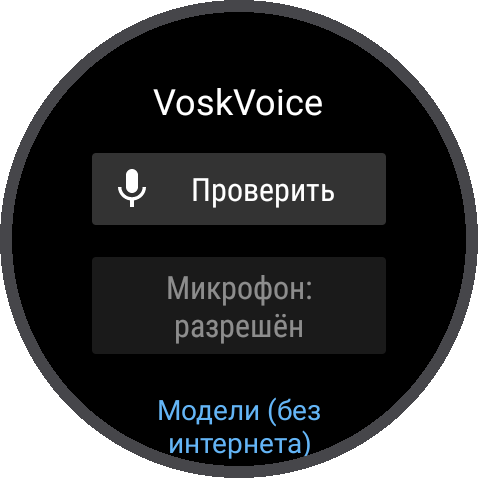
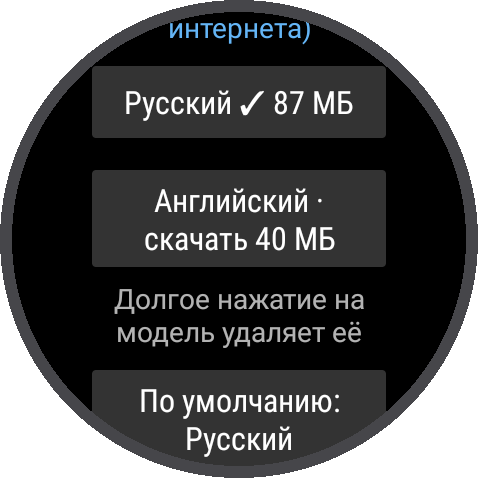

# VoskVoice — голосовой ввод без Google для Wear OS 3+

[English version](README.en.md)

[](https://github.com/iRapoo/VoskVoice/releases/latest)
[](https://github.com/iRapoo/VoskVoice/releases)
[](https://github.com/iRapoo/VoskVoice/actions/workflows/release.yml)

[](LICENSE)

Возвращает **голосовой ввод** на часы, где голосовой ввод Google перестал работать. Речь
распознаётся **прямо на часах** с помощью [Vosk](https://alphacephei.com/vosk/): русский и
английский, без интернета и без сервисов Google. Работает везде, где есть кнопка микрофона:
поиск, ответы на сообщения, заметки.

<p align="center">
  <a href="https://github.com/iRapoo/VoskVoice/releases/latest/download/VoskVoice.apk">
    
  </a>
  <br>
  <sub>Последняя версия · <a href="https://github.com/iRapoo/VoskVoice/releases">все релизы</a> · <a href="#установка">как установить</a></sub>
</p>

<p align="center">
  
  
  
</p>

- **Нажали микрофон — часы вибрируют — говорите.** Фраза заканчивается сама после паузы,
  нажатие на микрофон заканчивает раньше, свайп отменяет.
- **Без интернета.** Звук не покидает часы. Интернет нужен только один раз, чтобы скачать модель.
- **Русский и английский**, переключаются кнопкой `RU/EN` прямо на экране записи.
- **Мгновенный старт:** модель заранее загружена в память (режим можно выключить).

---

## Содержание

- [Проверено на часах](#проверено-на-часах)
- [Как это работает коротко](#как-это-работает-коротко)
- [Установка](#установка)
- [Модели](#модели)
- [Память и батарея](#память-и-батарея)
- [Приватность и безопасность](#приватность-и-безопасность)
- [Если что-то не работает](#если-что-то-не-работает)
- [Сообщить о проблеме](#сообщить-о-проблеме)
- [Удаление](#удаление)
- [Разработчикам](#разработчикам)
- [Лицензия](#лицензия)

---

## Проверено на часах

| Часы | Версия Wear OS | Результат |
|---|---|---|
| Mobvoi TicWatch Pro 3 GPS | 3.5 (RMRB.240228.002) | голосовой ввод в приложениях работает; голосовые ответы на уведомления ещё не проверены |

Проект молодой и пока проверен на одной модели. Если попробовали на своих часах,
[напишите](#сообщить-о-проблеме), что получилось: модель добавится в таблицу.

## Как это работает коротко

1. Когда приложение просит голосовой ввод, открывается экран **«Говорите»** VoskVoice.
2. Микрофон включается сразу, часы коротко вибрируют. Звук идёт в распознаватель **Vosk**
   (Kaldi), который работает на процессоре часов.
3. Текст появляется по мере речи. После паузы ~1,2 с фраза заканчивается, и текст уходит
   обратно в приложение.
4. Для приложений, которые распознают речь сами через `SpeechRecognizer`, VoskVoice также
   работает как **системный распознаватель**.

Подробно, с замерами: [docs/HOW_IT_WORKS.md](docs/HOW_IT_WORKS.md).

## Установка

Понадобятся часы на **Wear OS 3 или новее** (Android 11+) с микрофоном и компьютер с
**ADB** ([Android SDK Platform Tools](https://developer.android.com/tools/releases/platform-tools)).

### 1. Подключиться к часам по ADB

На часах:

1. **Настройки → Система → О часах → Версии**: 7 раз нажмите на **Номер сборки**, чтобы
   появились параметры разработчика.
2. **Настройки → Для разработчиков**: включите **Отладку по ADB** и **Отладку по Wi-Fi**
   (на некоторых часах пункт называется **Беспроводная отладка**).
3. Подключите часы к **той же сети Wi-Fi**, что и компьютер, и запомните IP-адрес и порт,
   которые показаны под пунктом отладки.

На компьютере:

```bash
# Wear OS 3 на TicWatch и похожих: адрес показан как IP:5555
adb connect 192.168.1.50:5555

# На новых часах с «Беспроводной отладкой» сначала нужно сопряжение:
#   на часах: Беспроводная отладка → Подключить устройство → запомнить IP:порт и код
adb pair 192.168.1.50:37123
adb connect 192.168.1.50:41234

adb devices   # часы должны быть в списке со статусом "device"
```

Если на часах появится запрос на отладку, подтвердите его.

> **Совет:** когда часы связаны с телефоном по Bluetooth, они отключают Wi-Fi ради экономии.
> Если соединение пропадает, откройте на часах настройки Wi-Fi и не давайте экрану погаснуть,
> пока выполняются команды.

### 2. Скачать APK

Скачайте [VoskVoice.apk](https://github.com/iRapoo/VoskVoice/releases/latest/download/VoskVoice.apk)
из последнего релиза. Каждый релиз собирается GitHub Actions прямо из исходного кода с
соответствующим тегом, [журнал сборок](https://github.com/iRapoo/VoskVoice/actions) открыт.

Хотите собрать сами — см. [Разработчикам](#разработчикам).

### 3. Установить

```bash
adb install -r VoskVoice.apk
```

Новая версия ставится той же командой поверх старой. Модели и настройки сохраняются.

### 4. Первый запуск

Откройте **VoskVoice** на часах:

1. Нажмите **Разрешить микрофон**.
2. В разделе **Модели** нажмите на нужный язык, чтобы скачать модель (русская ~45 МБ,
   английская ~40 МБ). Часы должны быть подключены к Wi-Fi.
3. Нажмите **Проверить** и скажите что-нибудь. Распознанный текст появится под кнопкой.

### 5. Сделать VoskVoice голосовым вводом по умолчанию

Нажмите микрофон в любом приложении, например в поиске или при ответе на сообщение. Часы
спросят, чем выполнить действие: выберите **VoskVoice** и **Всегда**.

В разделе **Система** на главном экране приложения видно, что сейчас открывает кнопка
голосового ввода: **VoskVoice ✓**, выбор приложения или другое приложение.

### 6. Системный распознаватель (необязательно)

Некоторые приложения не открывают экран голосового ввода, а распознают речь сами через
системный распознаватель. Чтобы они тоже использовали VoskVoice:

```bash
adb shell settings put secure voice_recognition_service xyz.quenix.voskvoice/.service.VoskRecognitionService
```

Проверить: в разделе **Система** должно быть **Системный распознаватель: VoskVoice ✓**.

## Модели

| Язык | Модель | Скачивание | На часах |
|---|---|---|---|
| Русский | [vosk-model-small-ru-0.22](https://alphacephei.com/vosk/models) | ~45 МБ | ~87 МБ |
| Английский | [vosk-model-small-en-us-0.15](https://alphacephei.com/vosk/models) | ~40 МБ | ~70 МБ |

Используются только **маленькие** модели: большим нужно 2+ ГБ памяти, а на часах свободно
около 300 МБ. Маленькие модели хорошо справляются с короткими фразами и ответами на сообщения,
но пишут текст без знаков препинания. Первая буква становится заглавной автоматически.

- **Скачать:** нажмите на язык в разделе **Модели**. Модели скачиваются с сайта проекта Vosk
  (alphacephei.com).
- **Удалить:** долгое нажатие на модель.
- **Язык по умолчанию:** кнопка **По умолчанию** на главном экране. На экране записи язык
  переключается кнопкой `RU/EN`, и последний выбранный язык становится языком по умолчанию. Если
  приложение само просит определённый язык, берётся он (если его модель скачана).

### Держать модель в памяти

Загрузка модели на часах занимает **5–8 секунд**: при загрузке распознаватель перестраивает
свои таблицы, и это упирается в процессор. Поэтому по умолчанию включён режим **«Держать модель
в памяти»**: небольшой фоновый сервис загружает модель заранее и не даёт системе её выгрузить,
так что голосовой ввод стартует сразу. После перезагрузки часов режим включается сам.

Цена — около **170 МБ оперативной памяти**. Если часам не хватает памяти для других приложений,
выключите режим на главном экране: тогда модель загружается при первом нажатии на микрофон и
выгружается через 5 минут простоя. Говорить можно сразу и в этом случае: звук записывается, пока
модель загружается, а текст появится через несколько секунд.

## Память и батарея

- **Память.** С загруженной моделью приложение занимает ~150–180 МБ. На TicWatch Pro 3 (1 ГБ)
  при этом остаётся свободно ~250 МБ.
- **Батарея.** В режиме ожидания приложение ничего не делает: сервис только держит модель в
  памяти, микрофон и процессор не используются. Микрофон работает только пока открыт экран
  «Говорите».
- Точных замеров расхода пока нет. Если заметите разницу во времени работы, напишите об этом
  и укажите модель часов.

## Приватность и безопасность

| Разрешение | Зачем |
|---|---|
| `RECORD_AUDIO` | Запись голоса. Только пока открыт экран «Говорите» или приложение запросило распознавание. |
| `INTERNET` | Только для скачивания моделей с alphacephei.com, когда вы нажимаете кнопку загрузки. |
| `FOREGROUND_SERVICE`, `FOREGROUND_SERVICE_SPECIAL_USE` | Сервис, который держит модель в памяти. Сам он микрофон не использует. |
| `RECEIVE_BOOT_COMPLETED` | Снова загрузить модель после перезагрузки часов. |
| `VIBRATE` | Вибрация «можно говорить». |

- **Звук и текст не покидают часы.** Распознавание полностью офлайн, звук нигде не сохраняется,
  распознанный текст не записывается в журнал.
- Никакой аналитики и рекламы. Из сторонних библиотек только
  [Vosk](https://github.com/alphacep/vosk-api) и [JNA](https://github.com/java-native-access/jna),
  через которую Vosk вызывает нативный код.
- Исходный код короткий и прокомментирован.

### Проверка подлинности APK

Все официальные релизы подписаны одним ключом. Отпечаток SHA-256 сертификата будет опубликован
здесь вместе с первым релизом.

Проверить скачанный файл (`apksigner` входит в Android SDK Build Tools):

```bash
apksigner verify --print-certs VoskVoice.apk
```

Строка `Signer #1 certificate SHA-256 digest` должна совпадать с опубликованным отпечатком.
Если не совпадает, это не официальная сборка.

## Если что-то не работает

**При нажатии на микрофон открывается Gboard, а не VoskVoice.**
Значит, в окне выбора уже нажали Gboard и «Всегда». Сбросьте это в настройках часов:
**Настройки → Приложения → Gboard**, пункт про действия по умолчанию (на разных часах называется
по-разному). Если такого пункта нет, удалите и снова установите VoskVoice: когда появляется новое
приложение для голосового ввода, Android снова показывает выбор. Модели придётся скачать заново.

**«Нет модели RU. Нажмите, чтобы скачать».**
Модель выбранного языка не скачана. Нажмите на надпись или скачайте модель на главном экране.

**Модель не скачивается.**
Проверьте, что часы подключены к Wi-Fi, а не только к телефону по Bluetooth. Если загрузка
прервалась, нажмите на модель ещё раз: загрузка начнётся заново.

**«Не расслышал».**
За 6 секунд не было речи. Говорите ближе к часам. Нажмите на микрофон, чтобы повторить.

**Распознаёт с ошибками.**
Маленькие модели лучше понимают короткие фразы и обычные слова. Говорите чуть медленнее и
чётче; имена и редкие слова модель может не знать.

**Первый раз после перезагрузки текст появляется с задержкой.**
Модель ещё загружается (5–8 секунд). Звук при этом уже записывается, говорить можно сразу.

**`INSTALL_FAILED_UPDATE_INCOMPATIBLE` при установке.**
На часах стоит версия, подписанная другим ключом (например, собранная самостоятельно). Удалите её
(`adb uninstall xyz.quenix.voskvoice`) и установите заново. Модели придётся скачать снова.

## Сообщить о проблеме

Создайте [issue](https://github.com/iRapoo/VoskVoice/issues/new/choose) и укажите:

- модель часов и версию Wear OS (**Настройки → Система → О часах**);
- версию приложения;
- в каком приложении вызывали голосовой ввод;
- что делали, что ожидали и что произошло.

Отзывы вида «работает на моих часах» тоже очень полезны.

## Удаление

```bash
adb uninstall xyz.quenix.voskvoice
```

или удалите из списка приложений на часах. Модели удалятся вместе с приложением. Если вы
назначали системный распознаватель, очистите настройку:

```bash
adb shell settings delete secure voice_recognition_service
```

## Разработчикам

### Сборка

```bash
git clone https://github.com/iRapoo/VoskVoice.git
cd VoskVoice
./gradlew testDebugUnitTest   # тесты, часы не нужны
./gradlew assembleRelease     # Windows: gradlew.bat assembleRelease
```

Нужны JDK 17+ и Android SDK, проще всего открыть проект в Android Studio. APK появится в
`app/build/outputs/apk/release/app-release.apk`. Самостоятельно собранный APK подписан вашим
отладочным ключом и не может обновить официальный релиз.

### Структура проекта

```
app/src/main/java/xyz/quenix/voskvoice/
├── speech/
│   ├── Dictation.kt           # микрофон → Vosk, буфер на время загрузки, конец фразы по паузе
│   ├── ModelCache.kt          # одна модель в памяти, выгрузка по простою или нехватке памяти
│   ├── TrimPolicy.kt          # когда отдавать модель системе (покрыт тестами)
│   ├── ModelStore.kt          # где лежат модели
│   ├── ModelDownloader.kt     # скачивание и распаковка на лету
│   ├── Language.kt            # языки и адреса моделей
│   └── TextFormat.kt          # заглавная буква, английское «I» (покрыт тестами)
├── service/
│   ├── VoskRecognitionService.kt  # системный распознаватель для SpeechRecognizer
│   └── ModelKeeperService.kt      # держит модель в памяти, автозапуск после перезагрузки
├── settings/
│   └── VoiceSettings.kt       # язык по умолчанию, режим «держать в памяти»
└── ui/
    ├── VoiceInputActivity.kt  # экран «Говорите» (RECOGNIZE_SPEECH)
    └── MainActivity.kt        # модели, настройки, проверка
```

Приложение, как и [WristGestures](https://github.com/iRapoo/WristGestures), использует только
Android framework, без AndroidX, чтобы оставаться лёгким на часах с 1 ГБ памяти.

### Отладка

```bash
./gradlew installDebug
adb logcat -s ModelCache Dictation ModelKeeper VoskRecognition ModelDownloader
```

В журнале видно время загрузки модели и скорость распознавания:

```
ModelCache: Loaded ru in 5539 ms
Dictation: Decoded 6200 ms of audio in 3344 ms
```

Открыть экран «Говорите» без другого приложения:

```bash
adb shell am start -n xyz.quenix.voskvoice/.ui.VoiceInputActivity -a android.speech.action.RECOGNIZE_SPEECH
```

Закинуть модель в **отладочную** сборку с компьютера, без скачивания на часах: распакуйте архив
модели, переименуйте папку в `ru` или `en` (внутри должны быть `am`, `conf`, `graph`, …) и
выполните:

```bash
adb push ru /data/local/tmp/
adb shell "chmod -R a+rX /data/local/tmp/ru && run-as xyz.quenix.voskvoice sh -c 'mkdir -p files/models && cp -r /data/local/tmp/ru files/models/' && rm -rf /data/local/tmp/ru"
```

### Документация

- [docs/HOW_IT_WORKS.md](docs/HOW_IT_WORKS.md) — как устроено распознавание, с замерами на часах.
- [docs/RELEASING.md](docs/RELEASING.md) — выпуск релиза и подпись APK.

### Как добавить язык

1. Добавьте константу в `Language` в `speech/Language.kt`: код, подпись, адрес маленькой модели
   с [alphacephei.com/vosk/models](https://alphacephei.com/vosk/models) и размер.
2. Добавьте название языка в `res/values/strings.xml` и `res/values-ru/strings.xml` и в
   `MainActivity.languageName`.

Pull request'ы приветствуются.

## Лицензия

[MIT](LICENSE). Можно свободно использовать, изменять и распространять.

[Vosk](https://github.com/alphacep/vosk-api) и модели Vosk распространяются по лицензии
Apache 2.0, [JNA](https://github.com/java-native-access/jna) — по лицензии Apache 2.0 или LGPL.

Проект не связан с Alpha Cephei, Mobvoi и Google. TicWatch — товарный знак Mobvoi, Wear OS и
Gboard — товарные знаки Google LLC. Приложение распространяется «как есть», без гарантий.
